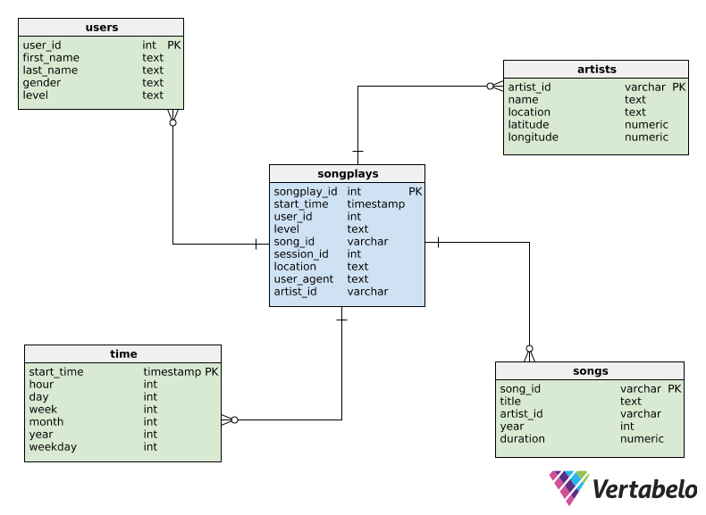

# Data_Warehouse_in_Amazon_Redshift

Designed and built a Data Warehouse for a startup music streaming app to analyze songs streaming trends. Defined fact and dimension tables for a star schema, wrote an ETL pipeline that copies data into staging tables from an S3 bucket to staging tables in Redshift.  The data is then loaded into the final tables of the star schema.

### Introduction

Sparkify is a startup music streaming app. The analytics team is interested in analyzing what kind of songs users are listening to and needs a data base designed to allow such analysis with easy queries.  The data they have resides in two S3 buckets in AWS:


### Dataset

1. A directory with JSON files with metadata on a song and the artist.

Each file is in JSON format and contains metadata about a song and the artist of that song.
Files are partitioned as following:
```
song_data/A/B/C/TRABCEI128F424C983.json
song_data/A/A/B/TRAABJL12903CDCF1A.json
```
The partitions are by the first three letters of each song's track ID.

The following is an example for what a single json file looks like:

```Python
{"num_songs": 1, "artist_id": "ARJIE2Y1187B994AB7", "artist_latitude": null, "artist_longitude": null, "artist_location": "", "artist_name": "Line Renaud", "song_id": "SOUPIRU12A6D4FA1E1", "title": "Der Kleine Dompfaff", "duration": 152.92036, "year": 0}

```
2. Second dataset is of JSON logs on user activity on the app.

The files are partitioned by the year and month of activity as following:

```
log_data/2018/11/2018-11-12-events.json
log_data/2018/11/2018-11-13-events.json
```

The data in each log file looks like the following:


### The Star Schema


### The ETL pipeline:


> RUN FIRST: create_tables.py : Script to create fresh database and tables.

> RUN SECOND: etl.py: Script to parse the log files and and extract data and populate the database with data. 

> dwh.cfg: Script that holds access keys and information to connect to Redshift and S3

> sql_queries.py : Holds query scripts for creating tables, inserting into tables and dropping tables.

> test.ipynb: For testing code
